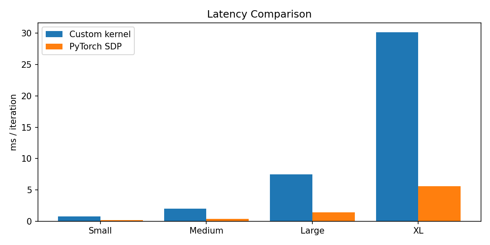
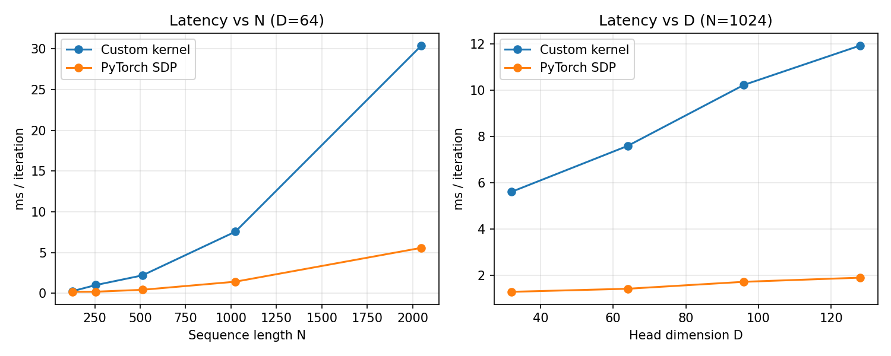
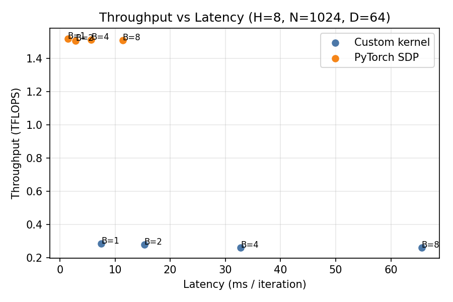
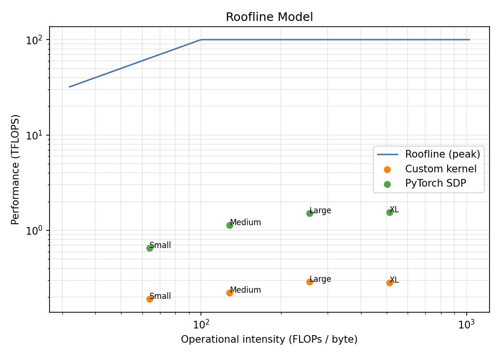

# FlashAttention Kernel: CUDA attention for NVIDIA GPUs

This repository centers on a CUDA FlashAttention-style kernel, the PyTorch C++/CUDA extension that exposes it, and the benchmark and Triton integration paths that exercise it. The codebase ties together kernel implementation, input validation, launch configuration, correctness checks against PyTorch SDPA, and performance analysis through multiple benchmark scripts and serving examples.

## 2. Demonstrated Capabilities

- **Kernel Design:** one warp per query row, shared-memory tiling, online softmax, and explicit launch geometry.
- **Systems Integration:** PyTorch C++/CUDA extension wiring with a Python entrypoint and strict input validation.
- **Performance Analysis:** latency, throughput, shape-scaling, and roofline-style benchmarking against PyTorch SDPA.
- **Production Deployment:** Triton model repository, Docker image, and example client for serving.
- **Correctness Engineering:** reference comparisons, tolerance checks, and negative-path validation.

## 3. Architecture & Design Decisions

### Execution Flow
1. `csrc/flash_attn_ext.cpp` validates inputs, allocates the output tensor, and launches the CUDA kernel on PyTorch's current stream.
2. `kernels/FlashAttentionKernel.cu` maps `grid.x` to `(batch, head)` and `grid.y` to query tiles.
3. Each warp computes one query row while keys and values stream through shared-memory tiles.
4. Online softmax keeps the computation numerically stable without materializing the full attention matrix.

### Memory Layout
- Inputs and outputs are contiguous row-major tensors with shape `[B, H, N, D]`.
- Shared memory uses a tight stride of `D` to keep the footprint predictable on smaller CUDA-capable GPUs.
- Tile sizes (`BLOCK_M = 16`, `BLOCK_N = 32`) balance reuse, occupancy, and shared-memory pressure.

### Engineering Trade-offs
- I kept the kernel intentionally simple and auditable instead of overfitting it to a single benchmark.
- The current implementation favors float32 correctness and clarity over tensor-core or mixed-precision complexity.
- One-warp-per-query is not the absolute fastest design, but it is easy to reason about, validate, and extend.
- The Triton/Docker path shows the kernel can live inside a serving stack, not just a notebook.

## 4. Performance Results & Interpretation

Regenerate these figures with `python3 -m pip install matplotlib && python3 benchmarks/config_sweep_benchmark.py`.

### Latency

#### Plot



#### Interpretation

The custom kernel is slower than PyTorch SDPA, but it tracks the same growth pattern as sequence length increases. That matters because it shows the implementation is structurally correct and scales like a real attention kernel, not a toy CUDA exercise. For interviewers, the important signal is that I can explain why the gap exists: PyTorch benefits from years of tuning, fused paths, and mature low-level optimizations that this project has not yet reached.

### Shape Scaling

#### Plot



#### Interpretation

This plot shows the kernel reacting predictably as `D` and `N` change, which is what you want from engineered GPU code. Larger head dimensions increase per-token work, while longer sequences stress the tiled key/value traversal and make memory behavior more visible. The point is not that the custom kernel wins everywhere; the point is that it behaves coherently across shapes and exposes the exact places where optimization effort should go.

### Throughput

#### Plot



#### Interpretation

As batch size increases, the kernel gets better utilization because the GPU has more independent work to schedule. PyTorch still wins on absolute numbers, but the trend is useful: it shows the implementation benefits from batching, and it highlights the deployment scenarios where a specialized kernel can be competitive enough to matter. This is the kind of reasoning I want reviewers to see—hardware-aware thinking, not just code that runs.

### Roofline

#### Plot



#### Interpretation

The roofline view places the kernel in a realistic performance context. It makes the compute-vs-bandwidth trade-off visible and shows why attention kernels live or die on memory behavior, arithmetic intensity, and launch efficiency. This is especially relevant for inference roles, where the goal is often to maximize useful work per byte moved rather than chase peak FLOPs in isolation.

## 5. Correctness & Validation

I validate the kernel in two ways: by comparing outputs against PyTorch SDPA forced onto the math backend, and by checking failure paths for device, dtype, contiguity, and shape mismatches. The tests also use multiple tensor shapes to cover more than one happy path and keep the kernel honest as dimensions change.

```bash
python3 tests/test_flash_attention.py
```

## 6. Quick Start

### Requirements

- CUDA-capable NVIDIA GPU
- PyTorch with CUDA support
- Python 3

### Build

```bash
python3 setup.py build_ext --inplace
```

### Example Usage

```python
import torch
import flash_attn_ext

q = torch.randn(1, 8, 256, 64, device="cuda", dtype=torch.float32)
k = torch.randn_like(q)
v = torch.randn_like(q)

out = flash_attn_ext.flash_attention_naive(q, k, v)
```

## 7. Optimization Roadmap

- Add mixed precision (`fp16`/`bf16`) and tensor-core-friendly paths.
- Use `cp.async` / double buffering to overlap global-memory traffic with compute.
- Explore a persistent-kernel or split-K style design for longer sequences.
- Fuse more work around the attention core, such as masking, dropout, or backward pass support.
- Auto-tune tile sizes, occupancy, and launch parameters per GPU generation.
- Extend roofline-style analysis to track achieved bandwidth and arithmetic intensity as the kernel evolves.
